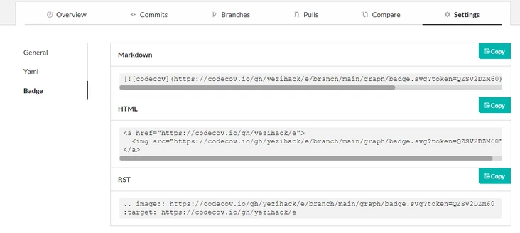

[toc]
# ActionsDemo
[](https://github.com/NicholeGit/ActionsDemo/actions)
[](https://github.com/NicholeGit/ActionsDemo)
[](https://codecov.io/gh/NicholeGit/ActionsDemo)

## github actions
> - [GitHub Actions 入门教程](http://www.ruanyifeng.com/blog/2019/09/getting-started-with-github-actions.html)
> - [使用 GitHub Actions 自动化构建 Golang 应用](https://blog.51cto.com/u_15077560/2584846)
- 当代码推送到 master和 release分支的时候触发构建
```yaml
on:
  push:
    branches:
    - master
    - release/*
```
- 当只有 pull_request被合并到 master分支的时候：
```yaml
on:
  pull_request:
    branches:
    - master
```
- 比如星期一到星期五的每天2点构建任务呢：
```yaml
on:
  schedule:
  - cron: 0 2 * * 1-5
```

## 徽章
> - [GitHub 徽章制作](https://segmentfault.com/a/1190000039065313)
> - [shields.io徽章只做网站](https://shields.io/)

### CI&CD 徽章
[](https://github.com/NicholeGit/ActionsDemo/actions)
```yaml
https://github.com/NicholeGit/ActionsDemo/workflows/Go/badge.svg
```
- `https://github.com/NicholeGit/ActionsDemo/` 是项目的地址
- `workflows/Go/badge.svg`  中间的 Go 是 `https://github.com/NicholeGit/ActionsDemo/actions` 下的名称。需要注意区分大小写

### Release 徽章
[](https://github.com/NicholeGit/ActionsDemo)
- 需要创建 release 版本才出现

### 测试覆盖率 徽章
[](https://codecov.io/gh/NicholeGit/ActionsDemo)
- 编写.travis.yml 文件
```yaml
language: go # 使用语言.
go: 
  - 1.15.6  # 版本号, 支持多种版本号

sudo: required #  #有定制化开发环境需要，默认false，不开启容器，编译效率高 

os:            # 使用的操作系统 
  - linux
  - osx

notifications:  # 邮箱通知
  email: freeit@126.com

go_import_path: # 使用Go需要导入的包. 
  - github.com/gin-gonic/gin
  - github.com/pkg/errors
  - github.com/smartystreets/goconvey

before_install: # 主要安装一些系统依赖,
  - go mod tidy

install: true # 安装, true跳过

script: # 脚本执行.
  - echo "run"
  - go test -race -coverprofile=coverage.txt -covermode=atomic
  - go test -v ./...

after_success: # 上传测试报告
  - bash <(curl -s https://codecov.io/bash)
```
- 在 https://codecov.io/ 使用 GitHub 帐号登陆  
点击Settings -> Badge

